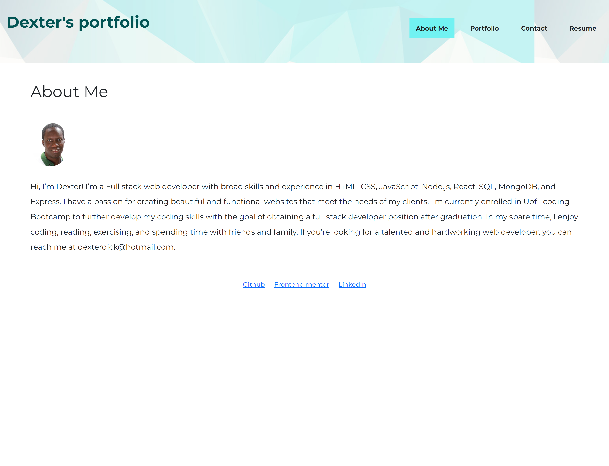

# Dexter's React Portfolio

# Description

My portfolio was created with React.js. It showcases 6 projects completed in my coding bootcamp.

The protfolio contains:

-   An About me page where you can learn more about my background, interests, and goals as a web developer.

-   A Portfolio page where you can see the screenshots and descriptions of my projects, as well as the links to the live demos and the source code.

-   A Contact page where you can send me a message if you are interested in working with me or hiring me.

-   A Resume page where you can download my resume and see a list of my skills and proficiencies.

The footer section contains links to my Github, Frontend mentor and LinkedIn profiles.

# Screenshot

## Github repository

https://github.com/DexterDick/dexter-react-portfolio

## Application Link
